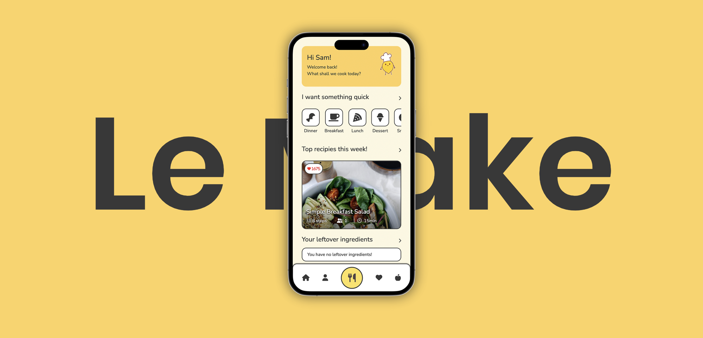

<H1>LeMake</H1>

your friendly AI-powered assistant chef!

<h2>Project Setup</h2>

 ⦿ Navigate to desired file directory  
 
 ⦿ Clone Repo using "gh repo clone HoraceLChen/LEMAKE"  

 ⦿ Open project file using VSCode  
 
 ⦿ Install all dependencies with "bundle install" in the terminal  

<h2>APIs and Keys</h2>

 <strong>NOTE! THIS APPLICATION USES MULTIPLE APIs </strong> 
 List of API keys required:
 
 ✦ Algolia   
 ✦ Cloudinary   
 ✦ OpenAI   
 ✦ Google API   
 ✦ Google CX   

<h2>Providing API Keys</h2>

 ⦿ In the root project folder of LEMAKE, navigate to the .env file. Create this file if it does not exist  

 ⦿ Open the .env file  
 
 ⦿ You will need to provide the following keys to ensure full functionality:  
 
ALGOLIA_APPLICATION_ID=(YOUR_ID_HERE) 
ALGOLIA_API_KEY=(YOUR_KEY_HERE) 
CLOUDINARY_URL=(YOUR_URL_HERE) 
OPENAI_ACCESS_TOKEN=(YOUR_KEY_HERE) 
GOOGLE_API_KEY=(YOUR_KEY_HERE) 
GOOGLE_CX_KEY=(YOUR_KEY_HERE) 

<h2>Local Testing</h2>

 ⦿ To run a local test, run command "rails s" in the terminal  

 ⦿ Open your webrowser and enter [localhost:3000](http://localhost:3000/) (this address may be different on your device, the local address should be found within the terminal logs  

<h2>Planned improvments</h2>
✦ CI/CD pipeline
✦ Optimisation of ingredients and recipe API call
✦ Add desktop experience

<h2>W.I.P features</h2>
✦ Migrate from Devise to Auth0
✦ Calorie + Nutrient tracker and diet/meal suggestions

